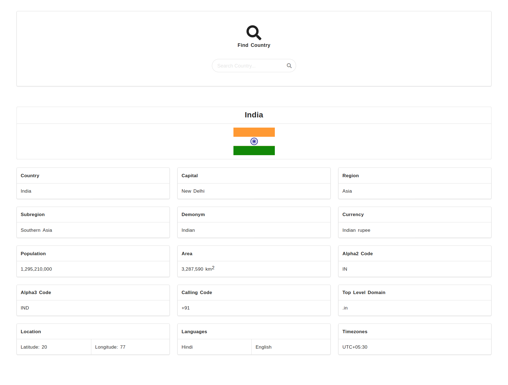
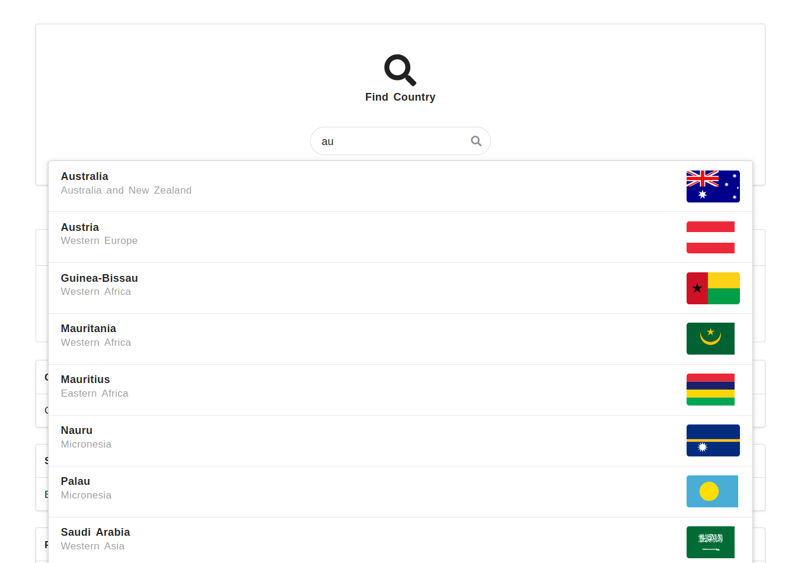
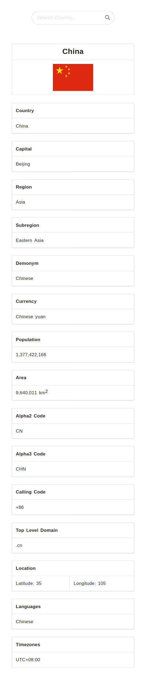

# Country Details App

Country Details Application is developed in [ReactJS](https://reactjs.org/) and [Semantic UI React](https://react.semantic-ui.com/). In this Application Search a Country and get genral information like region, capital, languages, population etc of that country.
[Axios](https://www.npmjs.com/package/axios) is used to fetch country list and country details.

#### Demo : [Link](https://4rshl.csb.app/)

### Demo Image :

###### 1. About India

  

###### 2. Search Suggestion

  

###### 3. About China (Mobile View)

  

#### Install Dependencies :

Clone or download the repo and run command in terminal
`npm install`

#### Run Application

After installing dependencies run command in terminal
`npm start`

### Built With :

- [ReactJS](https://reactjs.org/)
- [Semantic UI React](https://react.semantic-ui.com/)
- [npm axios](https://www.npmjs.com/package/axios)

### Developed By :

- [Shashi Kant Yadav](https://github.com/shashikant712)

### License :

- [ISC License](https://choosealicense.com/licenses/isc/)
